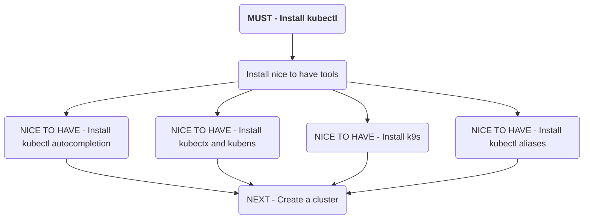

# Install kubectl

## Install kubectl
- [install kubectl - Kubernetes official documentation](https://kubernetes.io/docs/tasks/tools/#kubectl)

## Recommended Tools
- [kubectl auto completion setpup](https://kubernetes.io/docs/tasks/tools/included/optional-kubectl-configs-bash-linux/)
- [kubectx + kubens - Switch between contexts and namespace easily](https://github.com/ahmetb/kubectx)
- [k9s - terminal UI to interact with your Kubernetes clusters](https://github.com/derailed/k9s)
- [kubectl-aliases - premade kubectl aliases](https://github.com/ahmetb/kubectl-aliases)
