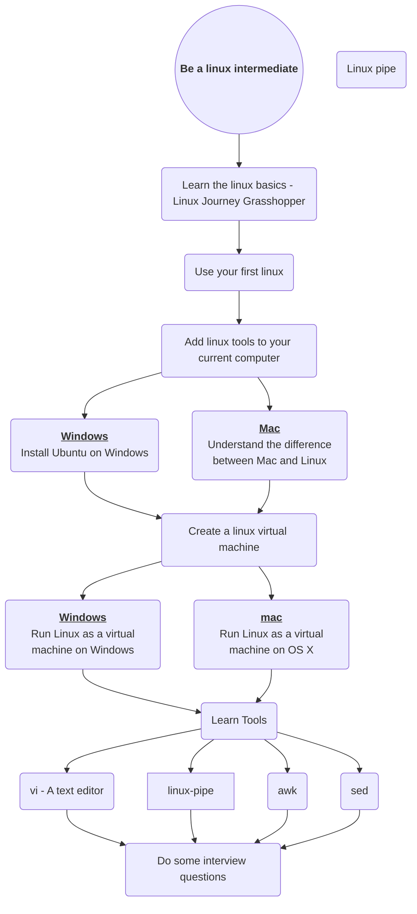

# Kubernetes Architecture

## Learn Linux
- [Linux Journey](https://linuxjourney.com/)
- [Introduction to Linux & Terminal Commands by Kunal Kushwaha](https://www.youtube.com/watch?v=iwolPf6kN-k)
- [Pick up one of the crash courses on YouTube](https://www.youtube.com/results?search_query=learn+linux)
