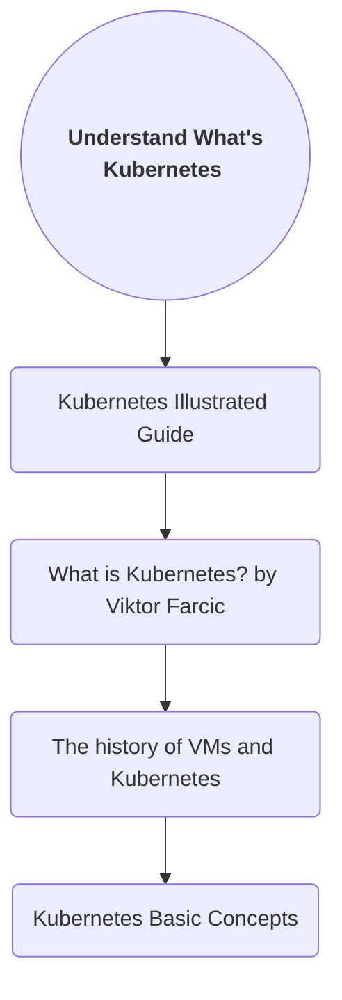

# What's Kubernetes

```mermaid
    flowchart TD;

    start((<b> Understand What's Kubernetes </b>))
    start --> k8s-illustrated-guide

    k8s-illustrated-guide(Kubernetes Illustrated Guide)
    click k8s-illustrated-guide "https://www.youtube.com/watch?v=4ht22ReBjno"
    k8s-illustrated-guide --> what-is-kubernetes

    what-is-kubernetes(What is Kubernetes? by Viktor Farcic)
    click what-is-kubernetes "https://m.youtube.com/watch?v=WxuvwSPSgXA&feature=youtu.be"
    what-is-kubernetes --> history-of-vms-and-kubernetes

    history-of-vms-and-kubernetes(The history of VMs and Kubernetes)
    click history-of-vms-and-kubernetes "https://8vc.com/2019/12/28/kubernetes-a-love-story/"
    history-of-vms-and-kubernetes --> k8s-basic-conecpts

    k8s-basic-conecpts(Kubernetes Basic Concepts)
    click k8s-basic-conecpts "https://www.youtube.com/watch?v=QJ4fODH6DXI"
    
```

## Learn Linux
- [What's Kubernetes - official documentation](https://kubernetes.io/docs/concepts/overview/what-is-kubernetes/)
