# The Kubernetes Journey
## The Kubernetes journey by the community for the community

A visulize guide to how to be a Kubernetes expert created by the community.
We belive that true power comes from the community.

## The Jounrey

Click on the kubes below to read the chapters.

```mermaid
    flowchart TD;
        start(Beginner  - your journey starts here)
        start --> fundamentals

        fundamentals(Build Your Fundamentals)
        fundamentals --> linux
        fundamentals -- I have strong foundations --> k8s-intro

            linux(Basic Linux)
            click linux "https://github.com/guymenahem/the-kubernetes-journey/tree/main/Beginner/basic-linux"
            linux --> networking
            linux --> containers

            networking(Optional -  Networking)
            click networking "https://github.com/guymenahem/the-kubernetes-journey/tree/main/Beginner/basic-networking"
            networking --> containers

            containers(Containers)
            click containers "https://github.com/guymenahem/the-kubernetes-journey/tree/main/Beginner/basic-containers"
            containers --> k8s-intro

        k8s-intro(Intro to Kubernetes)
        k8s-intro --> k8s-arch
        k8s-intro -- I know the architecture & concepts --> k8s-first-run

            k8s-arch(Kubernete Architecture) --> k8s-concepts

            k8s-concepts(Kubernetes Concepts) --> k8s-first-run

        k8s-first-run(Run you first cluster)
        k8s-first-run -- I Have a cluster --> k8s-first-resources
        k8s-first-run --> kubectl
        

            kubectl(Install kubectl)
            click kubectl "https://github.com/guymenahem/the-kubernetes-journey/tree/main/Beginner/install-kubectl"
            kubectl --> k8s-local

            k8s-local(Run a local kubernets cluster)
            k8s-local --> k8s-first-resources


        k8s-first-resources(Create your first resources)
        k8s-first-resources --> k8s-infra

        k8s-infra(Understand the infrastructure of the cluster)
        k8s-infra --> k8s-networking
        k8s-infra --> k8s-basic-finish

            k8s-networking(Networking)
            k8s-networking --> k8s-storage

            k8s-storage(Storage)
            k8s-storage --> k8s-nodes

            k8s-nodes(Nodes)
            k8s-nodes --> k8s-basic-finish

        k8s-basic-finish((Now you know the basics,\n let's go to the next level))
        k8s-basic-finish --> deployment-expert

        deployment-expert(Deployments & Pods Expert)
        deployment-expert --> stateful-expert

        stateful-expert(Stateful Sets & Volumes Expert)
        stateful-expert --> advanced-configuration

        advanced-configuration(Advanced Configuration & Secrets)
        advanced-configuration --> scaling-and-scheduling

        scaling-and-scheduling(Scaling & Scheduling)
        scaling-and-scheduling --> metrics-and-logs

        metrics-and-logs(Monitoring, Metrics & Logs)
        metrics-and-logs --> service-ingress

        service-ingress(Incoming traffic - service & ingress)
        service-ingress --> troubleshooting

        troubleshooting(Troubleshooting)
        troubleshooting --> security-expert

        security-expert(Security Expert) --> expert

        
        expert(K8S Expert! - your journey starts here)
```

## How to contribute?
- Open a PR 
- Email me - guy@thegoodguy.io
- [Follow me / tweet me - @the_guy_guym](https://twitter.com/the_good_guym)
