# The Kubernetes Journey
## The Kubernetes journey by the community for the community

A visualized guide to how to be a Kubernetes expert created by the community.
We believe that true power comes from the community.

 
 

# The Journey - Explore By Click The Blocks

```mermaid
    flowchart TD;
        start(Beginner  - your journey starts here)
        click start "https://github.com/guymenahem/the-kubernetes-journey/tree/main/Intros/journey-start"
        start --> fundamentals

        fundamentals(Build Your Fundamentals)
        click fundamentals "https://github.com/guymenahem/the-kubernetes-journey/tree/main/Intros/build-fundamentals"
        fundamentals --> linux
        fundamentals -- I have strong foundations --> k8s-intro

            linux(Basic Linux)
            click linux "https://github.com/guymenahem/the-kubernetes-journey/tree/main/Beginner/basic-linux"
            linux --> networking
            linux --> containers

            networking(Optional -  Networking)
            click networking "https://github.com/guymenahem/the-kubernetes-journey/tree/main/Beginner/basic-networking"
            networking --> containers

            containers(Containers)
            click containers "https://github.com/guymenahem/the-kubernetes-journey/tree/main/Beginner/basic-containers"
            containers --> k8s-intro

        k8s-intro(Intro to Kubernetes)
        click k8s-intro "https://github.com/guymenahem/the-kubernetes-journey/tree/main/Intros/intro-k8s"
        k8s-intro -- Interested in technical stuff  --> k8s-concepts
        k8s-intro -- I'm here for the overview  --> k8s-overview
        k8s-intro -- I know the architecture & concepts --> k8s-first-run

            k8s-concepts(Kubernetes Concepts) --> k8s-arch
            click k8s-concepts "https://github.com/guymenahem/the-kubernetes-journey/tree/main/Beginner/k8s-concepts"
            
            
            k8s-arch(Kubernetes Architecture) --> k8s-first-run
            click k8s-arch "https://github.com/guymenahem/the-kubernetes-journey/tree/main/Beginner/k8s-architecture"
            

            k8s-overview(Kubernetes Overview)
            click k8s-overview "https://github.com/guymenahem/the-kubernetes-journey/tree/main/Intros/k8s-overview"
            k8s-overview --> k8s-first-run

        k8s-first-run(Run your first cluster)
        click k8s-first-run "https://github.com/guymenahem/the-kubernetes-journey/tree/main/Intros/run-first-cluster"
        k8s-first-run -- I Have a cluster --> k8s-first-resources
        k8s-first-run --> kubectl
        

            kubectl(Install kubectl)
            click kubectl "https://github.com/guymenahem/the-kubernetes-journey/tree/main/Beginner/install-kubectl"
            kubectl --> k8s-local

            k8s-local(Run a local Kubernetes cluster)
            click k8s-local "https://github.com/guymenahem/the-kubernetes-journey/tree/main/Beginner/install-kubectl"
            k8s-local --> k8s-first-resources


        k8s-first-resources(Create your first resources)
        click k8s-first-resources "https://github.com/guymenahem/the-kubernetes-journey/tree/main/Beginner/run-first-resources"
        k8s-first-resources --> k8s-infra

        k8s-infra(Understand the infrastructure of the cluster)
        click k8s-infra "https://github.com/guymenahem/the-kubernetes-journey/tree/main/Intros/understand-cluster-infra"
        k8s-infra --> k8s-networking
        k8s-infra --> k8s-basic-finish

            k8s-networking(Networking)
            k8s-networking --> k8s-storage

            k8s-storage(Storage)
            k8s-storage --> k8s-nodes

            k8s-nodes(Nodes)
            k8s-nodes --> k8s-basic-finish

        k8s-basic-finish((Now you know the basics,\n let's go to the next level))
        click k8s-basic-finish "https://github.com/guymenahem/the-kubernetes-journey/tree/main/Intros/k8s-basic-finish"
        k8s-basic-finish --> deployment-and-pods

        deployment-and-pods(Deployments & Pods)
        click deployment-expert "https://github.com/guymenahem/the-kubernetes-journey/tree/main/Intermediate/deployments-and-pods"
        deployment-and-pods --> stateful-and-volumes

        stateful-and-volumes(Stateful Sets & Volumes Expert)
        click stateful-and-volumes "https://github.com/guymenahem/the-kubernetes-journey/tree/main/Intermediate/stateful-and-volumes"
        stateful-and-volumes --> advanced-configuration

        advanced-configuration(Advanced Configuration & Secrets)
        click advanced-configuration "https://github.com/guymenahem/the-kubernetes-journey/tree/main/Intermediate/advanced-configuration"
        advanced-configuration --> scaling-and-scheduling

        scaling-and-scheduling(Scaling & Scheduling)
        click scaling-and-scheduling "https://github.com/guymenahem/the-kubernetes-journey/tree/main/Intermediate/scaling-and-scheduling"
        scaling-and-scheduling --> metrics-and-logs

        metrics-and-logs(Monitoring, Metrics & Logs)
        click metrics-and-logs "https://github.com/guymenahem/the-kubernetes-journey/tree/main/Intermediate/metrics-and-logs"
        metrics-and-logs --> service-ingress

        service-ingress(Incoming traffic - service & ingress)
        click service-ingress "https://github.com/guymenahem/the-kubernetes-journey/tree/main/Intermediate/service-and-ingress"
        service-ingress --> troubleshooting

        troubleshooting(Troubleshooting)
        click troubleshooting "https://github.com/guymenahem/the-kubernetes-journey/tree/main/Intermediate/troubleshooting"
        troubleshooting --> security

        security(Security) --> expert
        click security "https://github.com/guymenahem/the-kubernetes-journey/tree/main/Intermediate/security"

        
        expert(K8S Expert! - your journey starts here)
```

## How to contribute?
- Open a PR 
- Email me - guy@thegoodguy.io
- [Follow me / tweet me - @the_guy_guym](https://twitter.com/the_good_guym)
