# The Kubernetes Journey
## The Kubernetes journey by the community for the community

This repo is a visulize guide with refrenace to specifc contant what will help you to learn Kubernetes.

## The jounrey

```mermaid
    flowchart TD;
        start(Beginner  - your journey starts here)
        start --> fundamentals

        fundamentals(Build Your Fundamentals)
        fundamentals --> linux
        fundamentals -- I have strong foundations --> k8s-intro

            linux(Basic Linux)
            linux --> networking

            networking(Networking)
            networking --> containers

            containers(Containers)
            containers --> k8s-intro

        k8s-intro(Intro to Kubernetes)
        k8s-intro --> k8s-arch
        k8s-intro -- I know the architecture & concepts --> k8s-first-run

            k8s-arch(Kubernete Architecture) --> k8s-concepts

            k8s-concepts(Kubernetes Concepts) --> k8s-first-run

        k8s-first-run(Run you first cluster)
        k8s-first-run -- I Have a cluster --> k8s-first-resources
        k8s-first-run --> kubectl
        

            kubectl(Install kubectl)
            kubectl --> k8s-local

            k8s-local(Run a local kubernets cluster)
            k8s-local --> k8s-first-resources


        k8s-first-resources(Create your first resources)
        k8s-first-resources --> k8s-infra

        k8s-infra(Understand the infrastructure of the cluster)
        k8s-infra --> k8s-networking
        k8s-infra --> k8s-basic-finish

            k8s-networking(Networking)
            k8s-networking --> k8s-storage

            k8s-storage(Storage)
            k8s-storage --> k8s-nodes

            k8s-nodes(Nodes)
            k8s-nodes --> k8s-basic-finish

        k8s-basic-finish((Now you know the basics,\n let's go to the next level))
        k8s-basic-finish --> deployment-expert

        deployment-expert(Deployment expert) -- to be continued... --> expert


        
        expert(K8S Expert! - your journey starts here)
```

